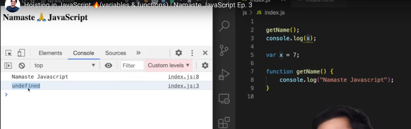
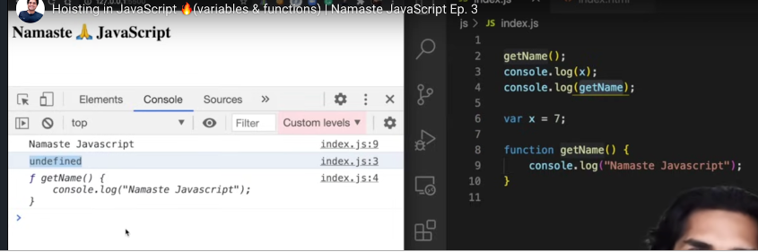
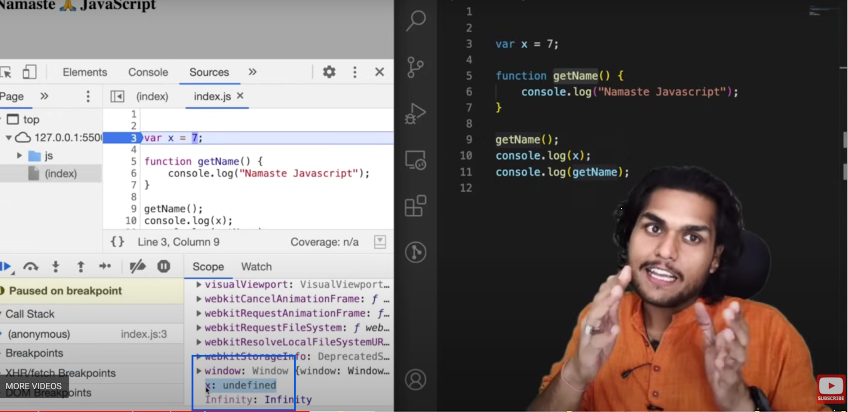
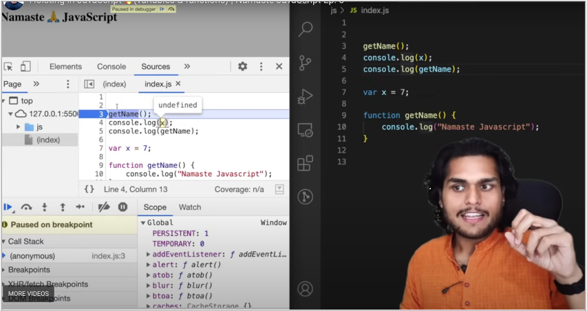
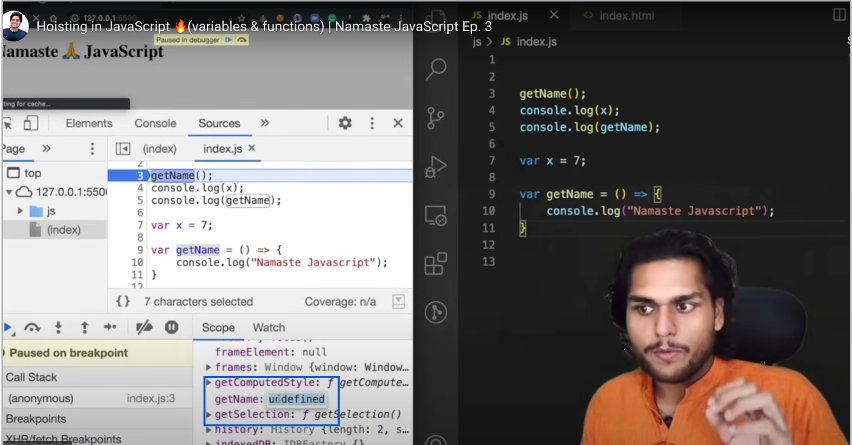
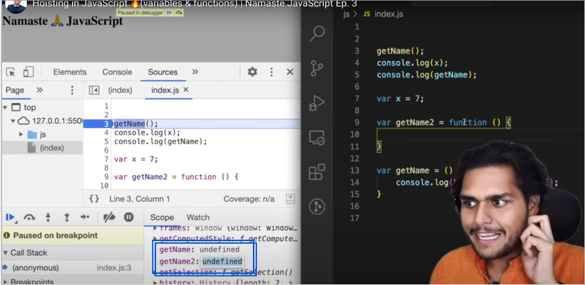
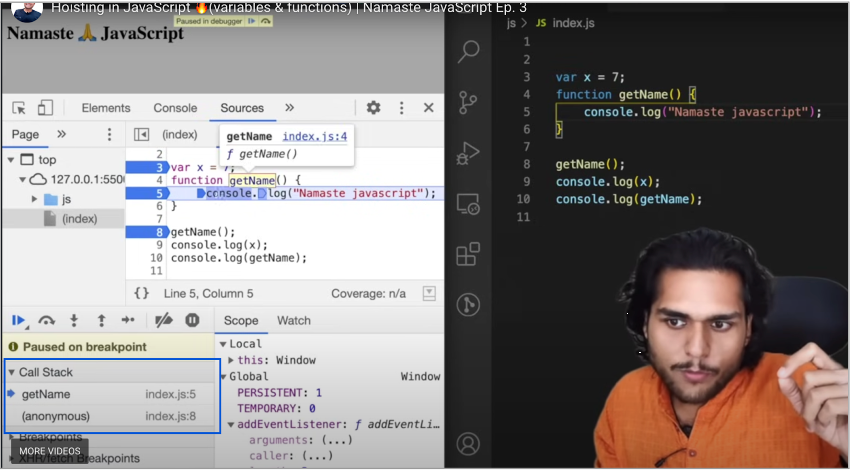
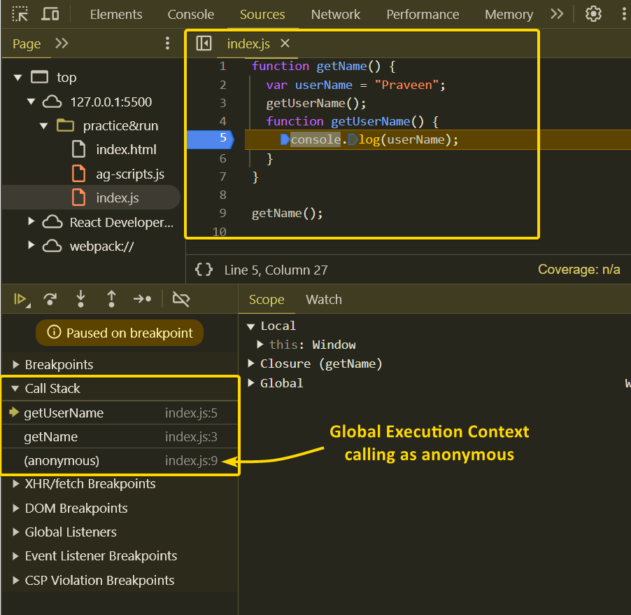

# E3 - Hoisting in JavaScript 🔥(variables & functions)

> Hoisting as a core concept relies on the way how Execution Context is created. In the first phase i.e. the Memory Allocation Phase all the variables and functions are allocated memory, even before any code is executed. All the variables are assigned undefined at this point in time in the local memory.

- Answer in Memory creation phase & Code execution phase

- What happens when run below the piece of JS code ?

  ```javascript
  getName();
  console.log(x);

  var x = 7;

  function getName() {
    console.log("Welcome to JS");
  }
  ```

- Magic of JS hoisting

  - 
  - 
  - 

- Is it **<mark>undefined</mark>** and **<mark>not defined</mark>** both are same ?

  - Ans: NO, Both are different

- **<mark>JS Hoisting is behavior where accessing all JS variables & function even before initialized it, without any error</mark>**
- Even before code starts executing, memory is allocating to all JS variables & functions during memory creation phase

  - 
  - 

- **<mark>Not defined</mark>**

  - When memory is not allocated for variable x, since not defined, will get error when trying to access or use

  - 

- If function defined with fat arrow function or variable access

  - 
  - 

- **<mark>Call Stack in browser - maintains the order of Execution of Execution contexts</mark>**
  - 
  - Call Stack in client side browser dev tool, where Global Execution Context calling as anonymous name
    - 
