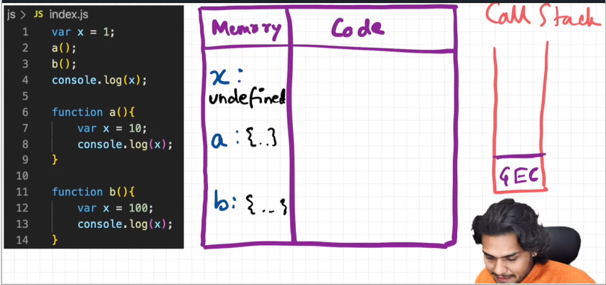
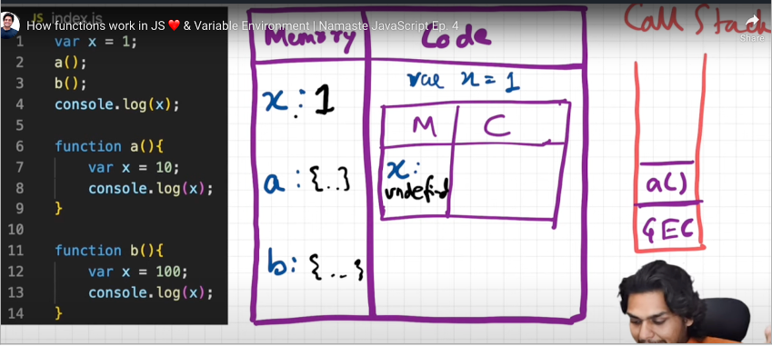
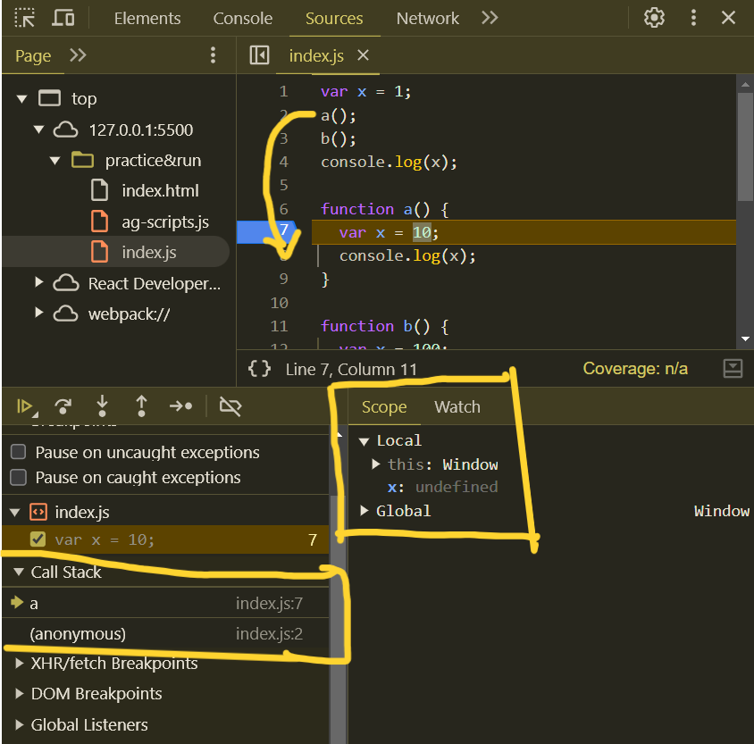
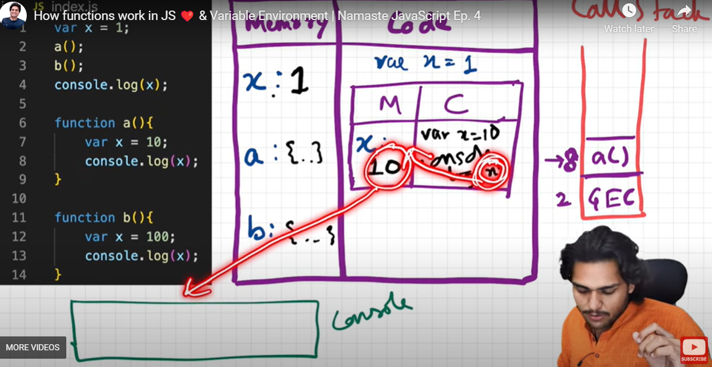
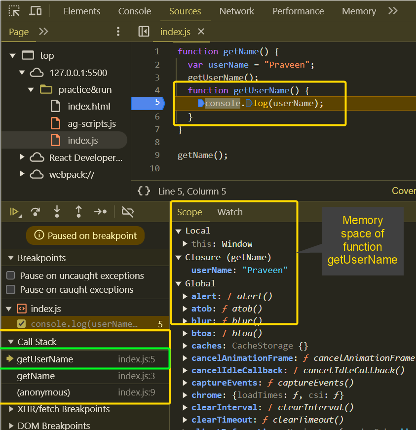
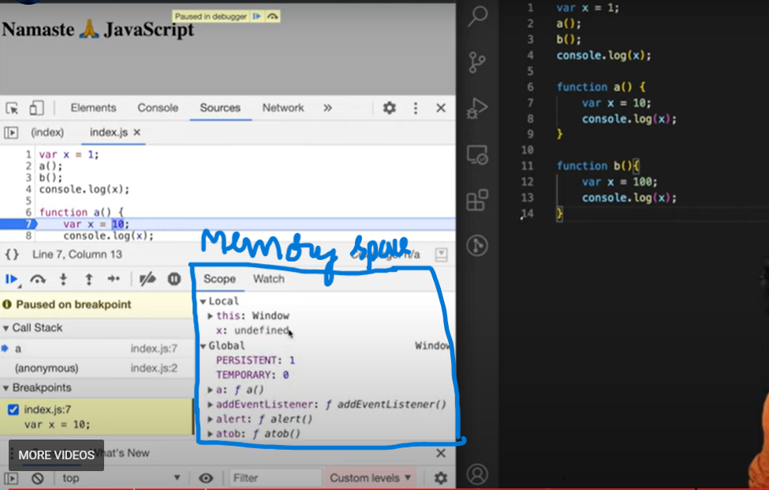
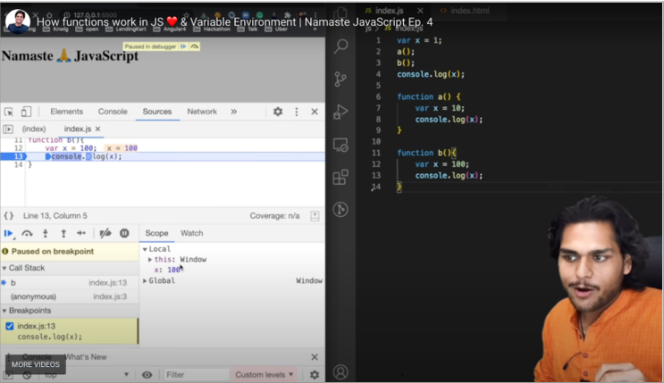

# E4 - How functions work in JS ❤️ & Variable Environment

> Understand how Functions work behind the scenes in JavaScript.What happens when a function is executed/invoked inside the JS Engine. This video covers an in-depth analysis of function execution and its variable environments.

> Whenever a function is invoked in JavaScript a functional Execution Context is created and memory is allocated. Once the memory is allocated to the variables and functions, then the code is executed synchronously, one line at a time. Let's check all that with examples in the video.

- What happens when run below the piece of JS code and how function invocation/calling will handle behind the scene, suppose if same variable name defined, used in multiple functions, how it will handle.

  > Observe the browser **call stack, local & global memory spaces** by adding debugger while executing below code

  ```javascript
  var x = 1;
  a();
  b();
  console.log(x);

  function a() {
    var x = 10;
    console.log(x);
  }

  function b() {
    var x = 100;
    console.log(x);
  }
  //output: 10 100 1
  ```

- **<mark>Functions are heart of javascript, act as mini program</mark>**

- As soon as invoke / call the function, pushed in Call Stack

- Global Execution context & functions

  - 
  - 
  - 
  - 

- **<mark>While executing Each function has its own / separate memory space, which is independent</mark>**

  - 
  - 

- By executing JS code, will understand

  - Call stack, where is the controls with line number
  - Separate memory space for function (local, global memory)
  - Memory creation & Code execution phase for Execution contexts
  - 
