# E7 - The Scope Chain, 🔥Scope & Lexical Environment

> Diving deep into Scope, Lexical Environment, and The Scope Chain in JavaScript with a lot of code examples and visuals. This is a HOT interview topic and this video cover everything that happens under the hood. The video is a little long but I REQUEST YOU to watch it fully, this concept will help us in later videos. 🙏

> Along with Code Examples, I've shown all these concepts visually so that it helps you better understand. And not only these, but I also covered a proper demo of Scope and The Scope chain in Browser. That's amazing, do watch it. You'll definitely fall in love with The Scope Chain in JS. ❤️

- Scope in javascript directly related to Lexical Environment

- Run below code and check the output

  ```javascript
  function getName() {
    // can we access userName in getName function? what javascript will do when looking for userName
    console.log(userName);
    // js engine will look for userName in local memory spaces of getName function execution context
  }
  var userName = "Praveen";
  getName();

  // output - Praveen
  // userName is access inside getName function, which defined in outside
  ```

  - 

- Run below JS code, check the output

  ```javascript
  function getName() {
    getUserName();
    function getUserName() {
      console.log(userName);
    }
  }
  var userName = "Praveen";
  getName();
  // output - Praveen
  // userName is access inside getUserName function, defined under another function
  ```

  - 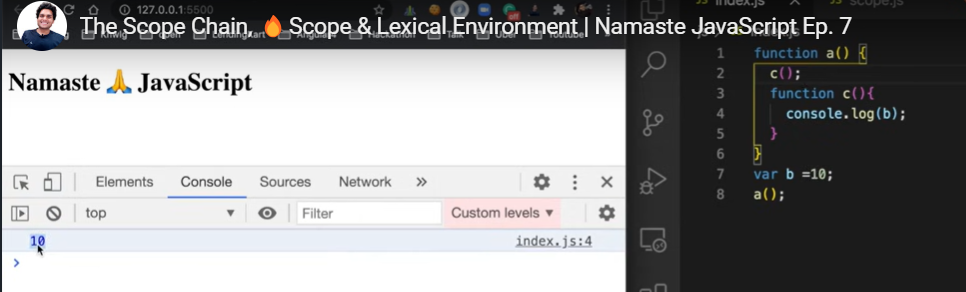
  - 

- Run below JS code, check the output variable userName not able to access

  ```javascript
  function getName() {
    var userName = "Praveen";
    getUserName();
    function getUserName() {
      console.log(userName); // userName able to access from getName function, print output as Praveen
    }
  }

  getName();
  console.log(userName); // Getting error not defined, userName not able to access from getName function
  ```

  - 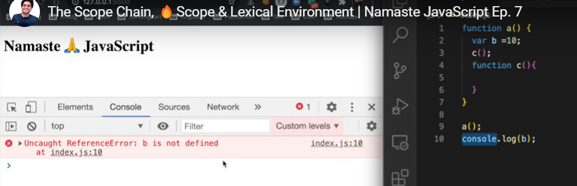

- **<mark>What is Scope</mark>**

  - **<mark>Where you can access specific variables, functions in our code</mark>**
  - Scope of variables, functions

  ```javascript
  function getName() {
    var userName = "Praveen"; // what is the scope of variable userName, which means where can access variable userName
    getUserName();
    function getUserName() {
      console.log(userName); // Is userName inside the scope of function getUserName, can access userName inside getUserName function
    }
  }

  getName();
  console.log(userName);
  ```

- Lexical Environment

  - When global execution context created, allocate memory for global variables, functions

  - 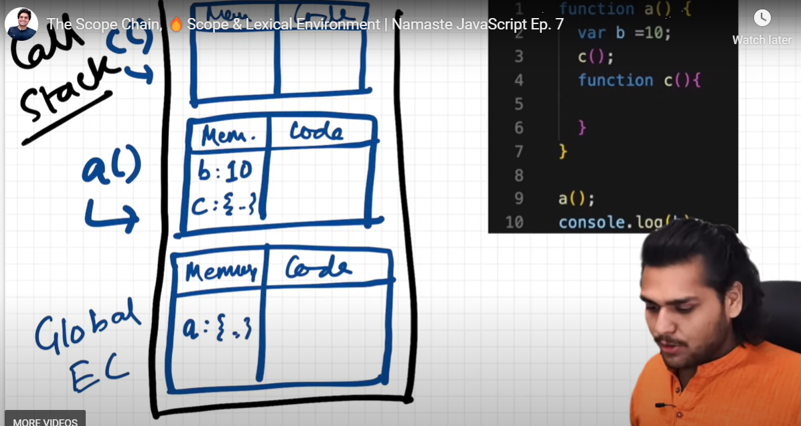

  - **<mark>When ever Execution context created, Lexical Environment also created, along with Lexical Environment of its parent</mark>**
  - **<mark>Lexical Environment is the local memory space along with Lexical Environment of its parent</mark>**
  - Lexical term meaning sequence or hierarchy
  - In technical, lexically means, in below JS code getUserName function lexically setting inside getName function, which is getUserName function physically present inside getName function and getName function lexically inside global scope

    - ```javascript
      function getName() {
        var userName = "Praveen";
        getUserName();
        function getUserName() {
          console.log(userName);
        }
      }

      getName();
      console.log(userName);
      ```

  - 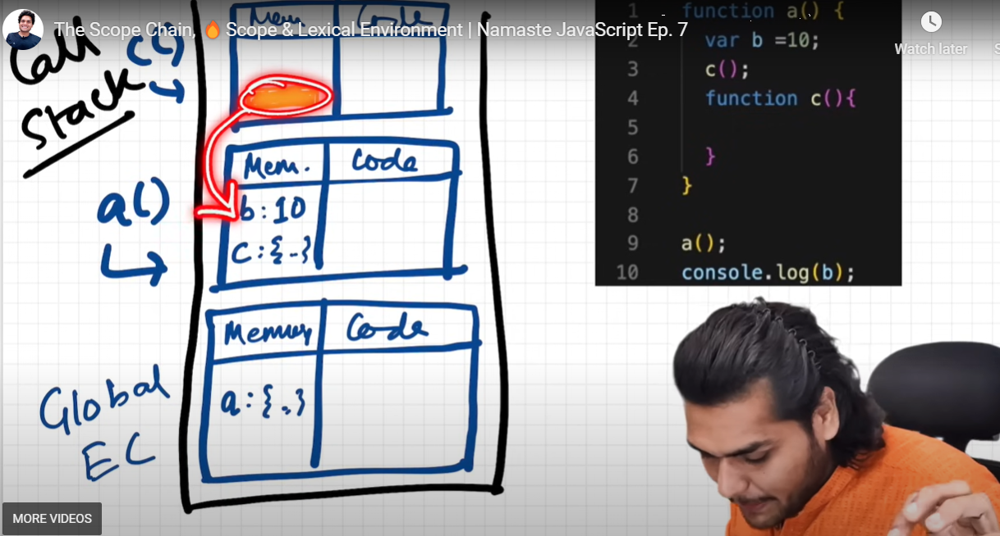
  - 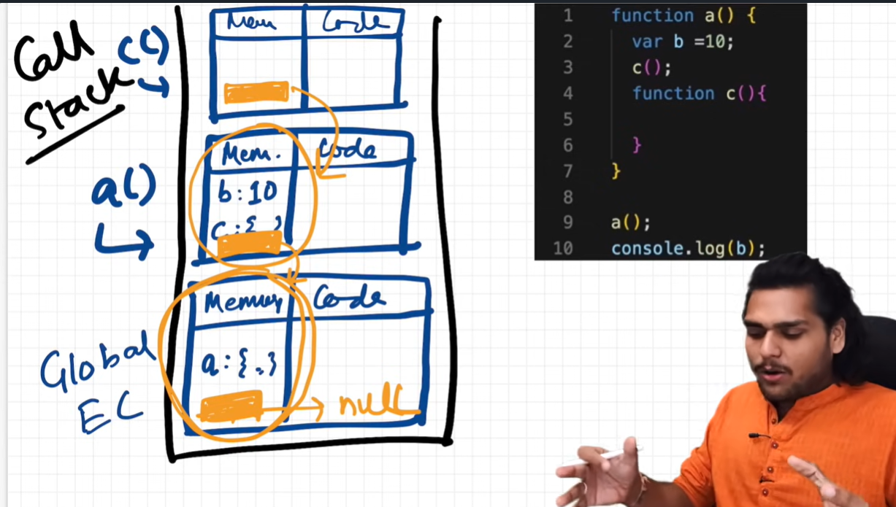
  - What happens when run below JS code

    - ```javascript
      function getName() {
        var userName = "Praveen";
        getUserName();
        function getUserName() {
          console.log(userName);
          // first look for local memory space for userName, if not find then look into its lexical env of its parent reference
        }
      }

      getName();
      ```

  - The mechanism of finding variables, starting from local memory space, then referring from lexical env of its parent, referring to its parent calling as Scope chain, chain of all lexical env of its parent references

    - 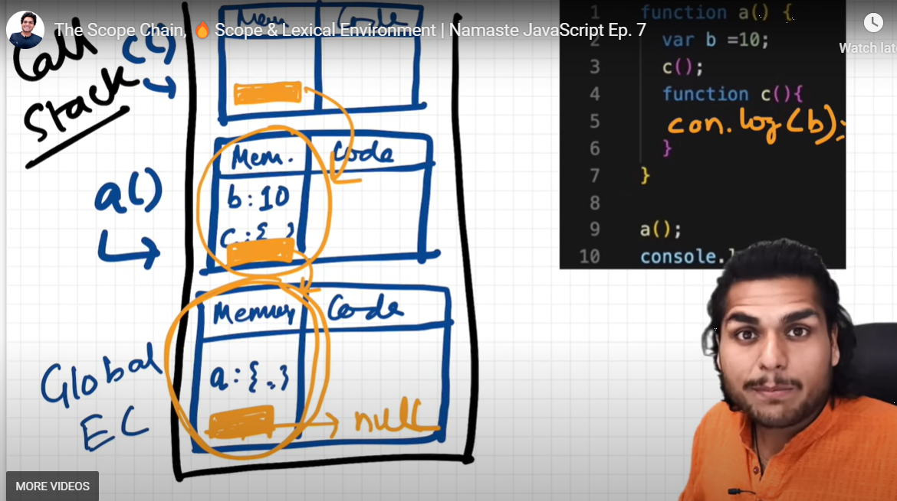

  - Lexical Env, scope chain in actual browser

    - 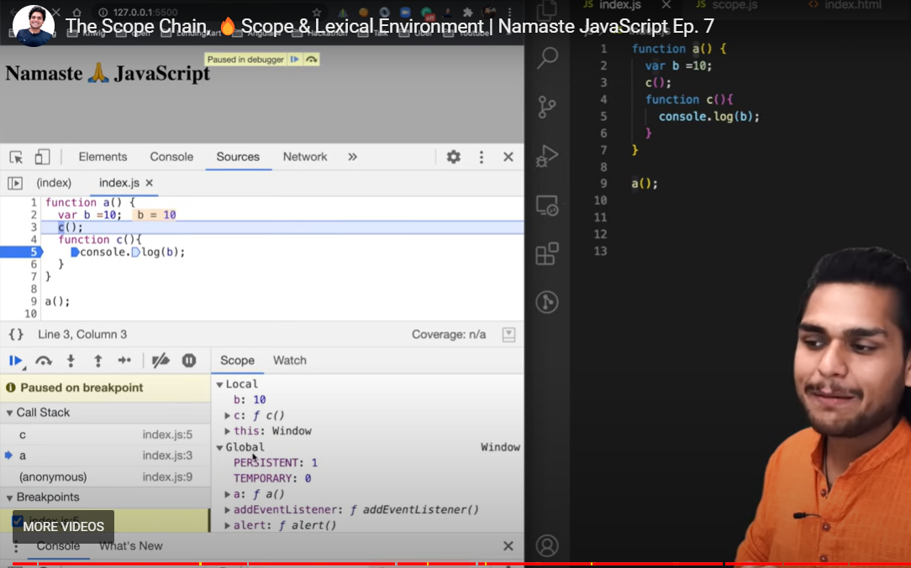

    - 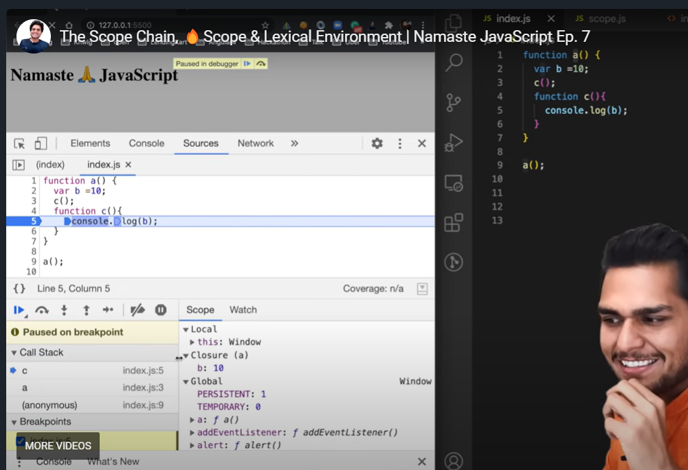

    - 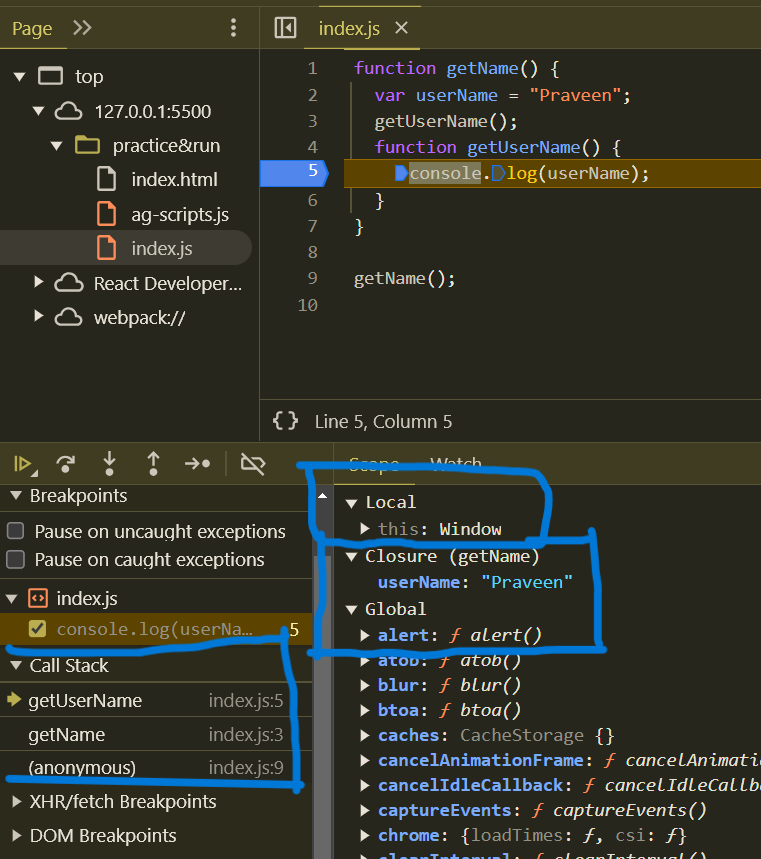

    - 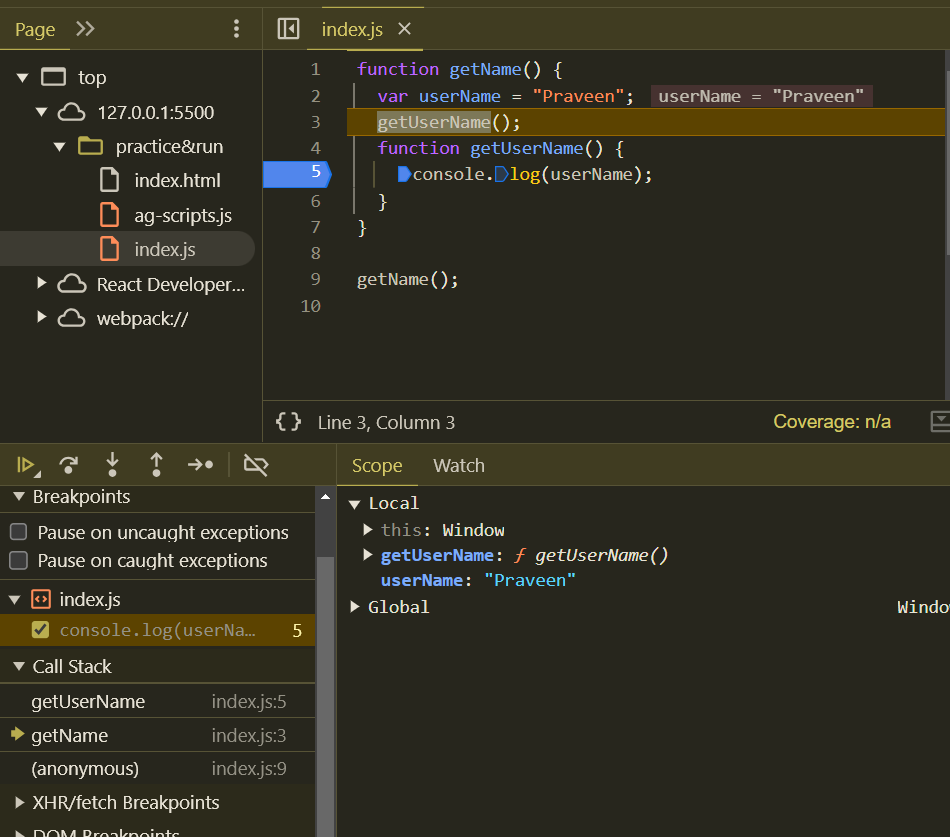

    - 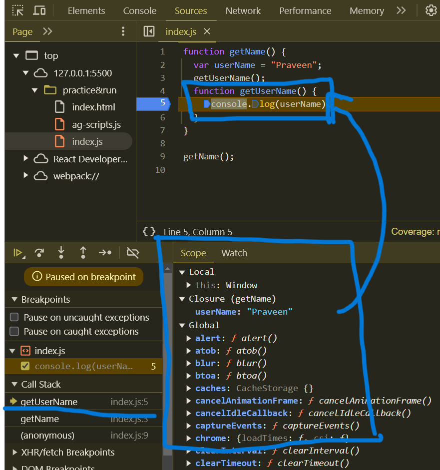

    - 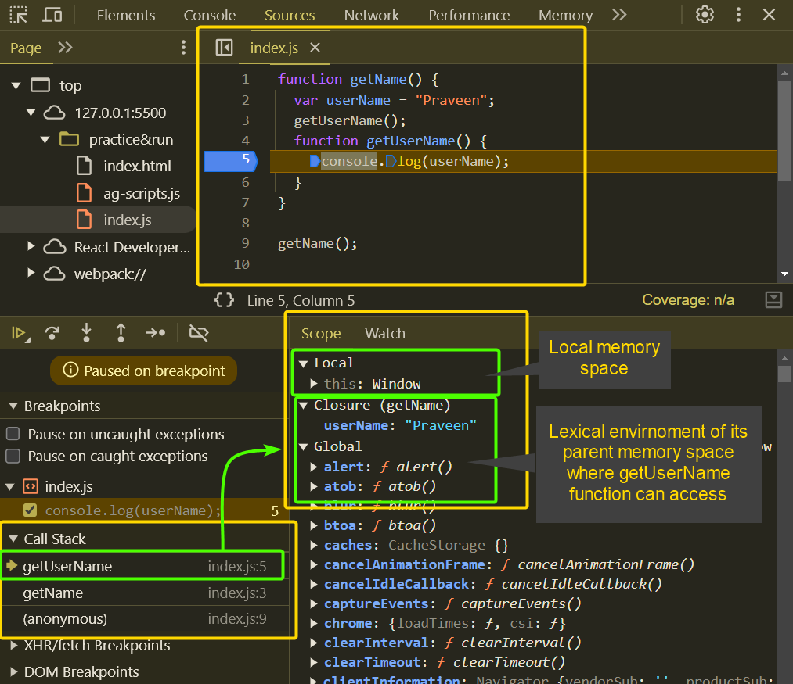
