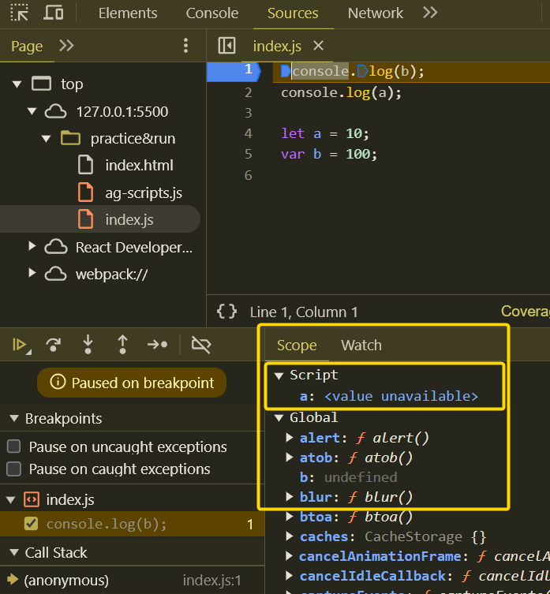
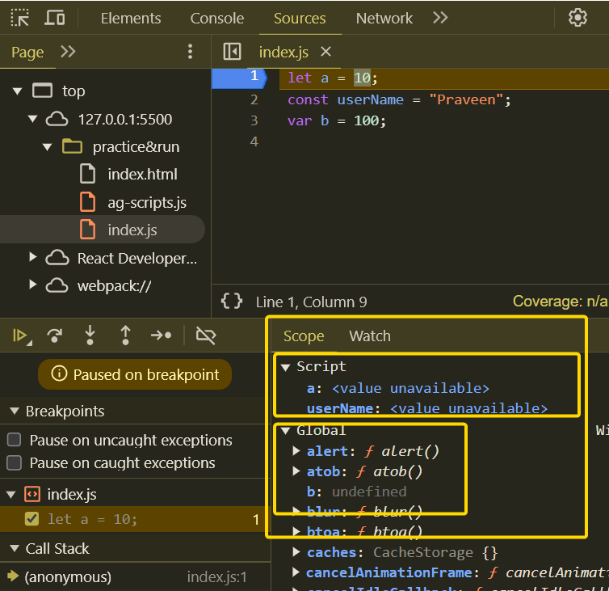
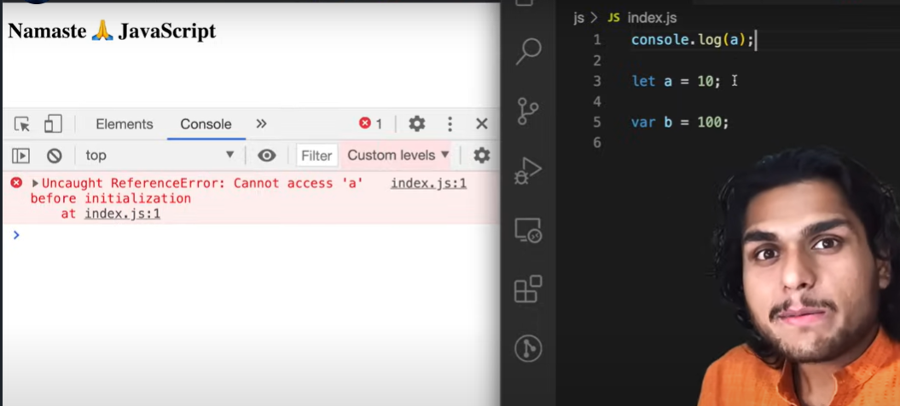
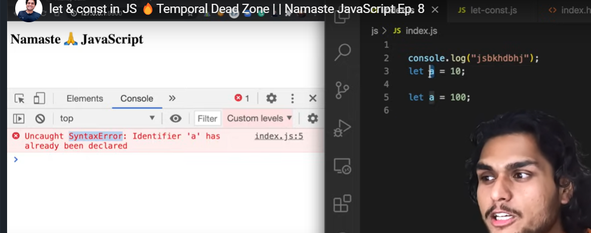
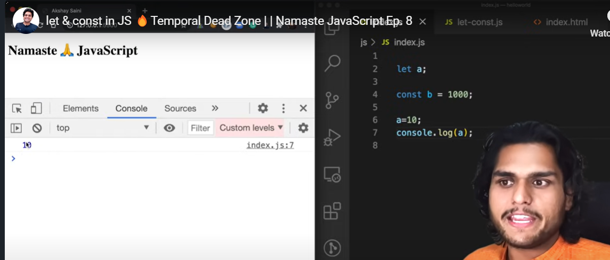
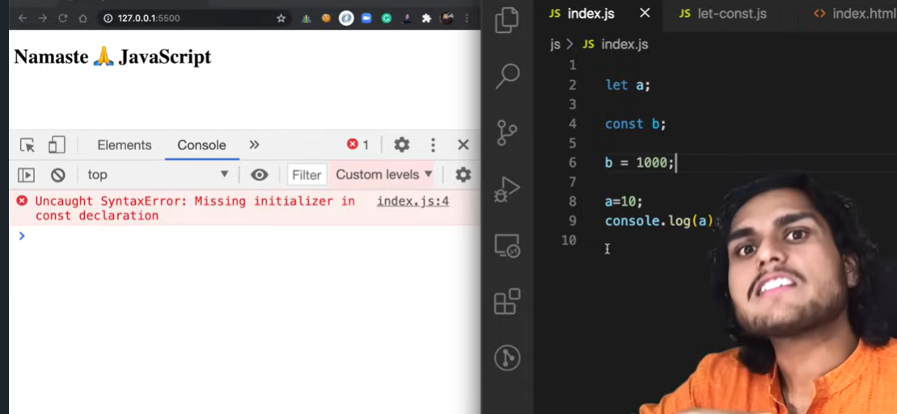
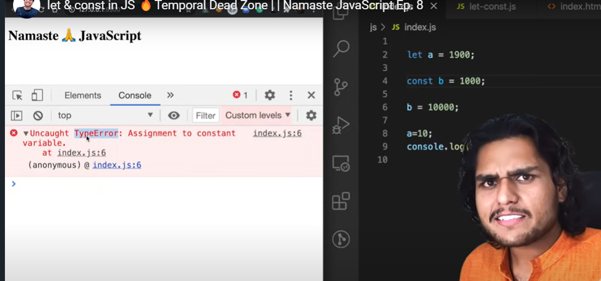

# E8 - let & const in JS 🔥Temporal Dead Zone

> let & const in JavaScript behave differently when they are Hoisted. Understanding the difference between var, let and const in JS will help you write better code. const and let are in a Temporal Dead Zone until they are initialized some value. You might encounter SyntaxError, TypeError or ReferenceError while using them in your code.

> This JavaScript tutorial video covers everything in depth about how let and const are hoisted and how let in js is different from var and const in JS. We will also see what happens behind the scenes in the browser when you use them in code. Another exciting part of the video is the explanation of the difference between Syntax Error, Reference Error, and Type Error in JavaScript.

- Check below
  - What is **<mark>Temporal Dead Zone</mark>** ?
  - **<mark>Are let & const declarations are hoisted in Javascript </mark>**?
    - Ans - YES, hoisted very differently compare to var declarations, and these are in temporal dead zone for time being
  - What is the difference between
    - Syntax error - invalid JS syntax error, will not execute any JS code
    - Reference error - when try to access variable, which is not allocate any memory to that, when js engine try to find out specific variables inside the memory space, and can not be access it
    - Type error -
- Comparison of var, let, const hoisting

  - Compare to var, let & const are more strict
  - Even before start executing, allocate separate memory space for let variables, which is hoisted
    - 
  - For let declarations, without initializing if trying to access before, will get Uncaught ReferenceError: Cannot access 'a' before initialization
    ```javascript
    console.log(b);
    console.log(a);
    let a = 10;
    var b = 100;
    ```

- For var declaration allocate memory & attach to Global window object, but in case of let & const also allocate memory before starts executing, but allocate memory in separate memory space, not in Global window object and we can not access let & const until initialize some values

  - 

- **<mark>What is Temporal Dead Zone ?</mark>**

  - **<mark>Temporal Dead Zone is time since when let, const declarations are hoisted and till initialize some values. Time between that is Temporal dead zone</mark>**
    - Phase which hoisted and till assign / initialize some values
    - When ever trying access in Temporal dead zone, it gives Uncaught ReferenceError: Cannot access 'a' before initialization. In below case, variable a is in Temporal dead zone, can be accessed only after initialize
      - 

- Syntax Error

  - (Invalid JS error) Up front through the JS syntax error, will not execute single of JS code

    - 

- let and const

  - let is used to define variable, initialize later in code & change the values according to requirement
  - const is used to define the constants, once initialize done, can not reassign it and expect to initialize some values during declaration it self in same line

  - 
  - 
  - Type error
    - 

- var, let & const
  - better to use let & const in recent days of coding styles
- How to avoid Temporal Dead Zone, getting unexpected errors
  - Always keep declaration & initialization at the top of scope
