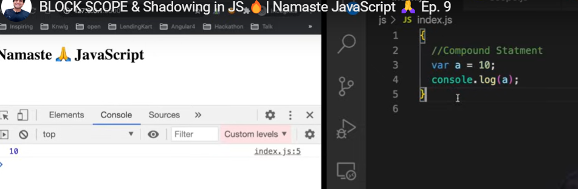
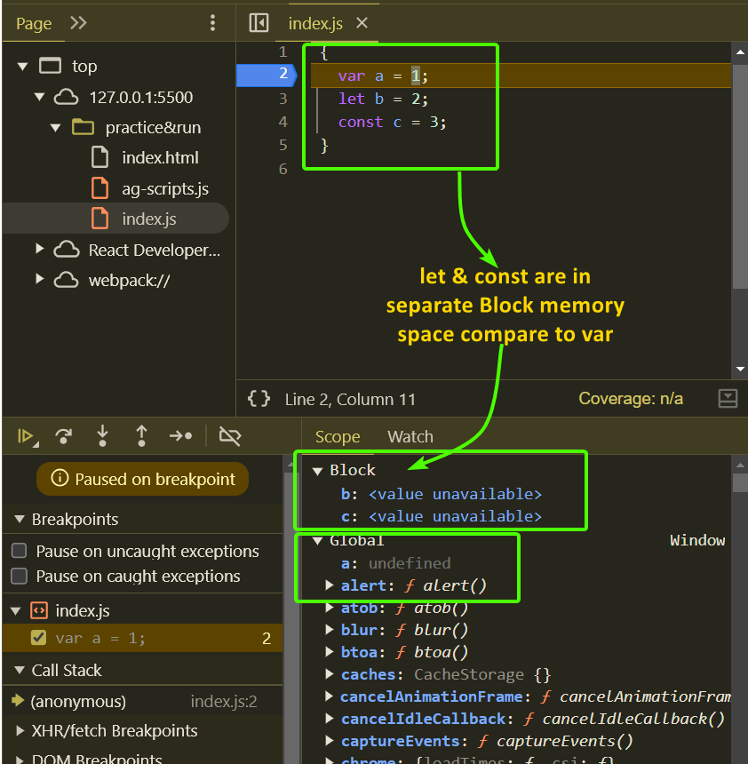
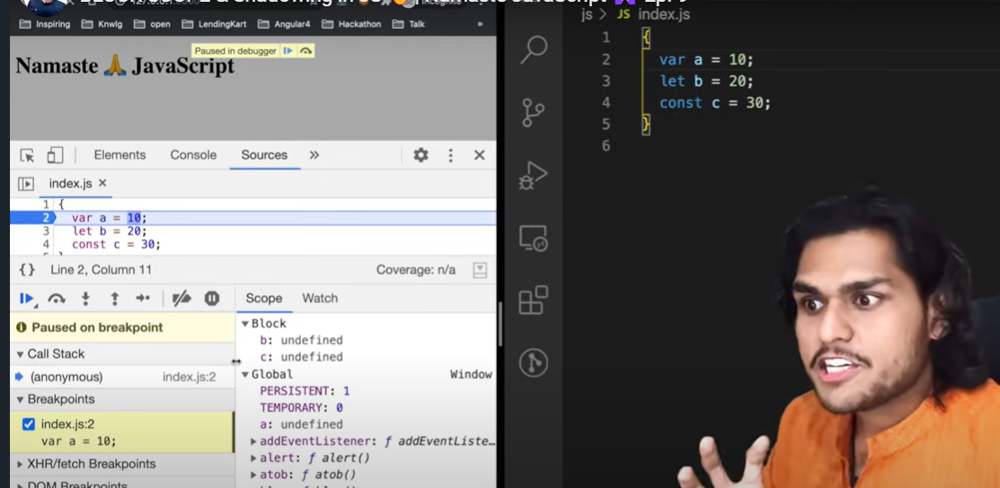
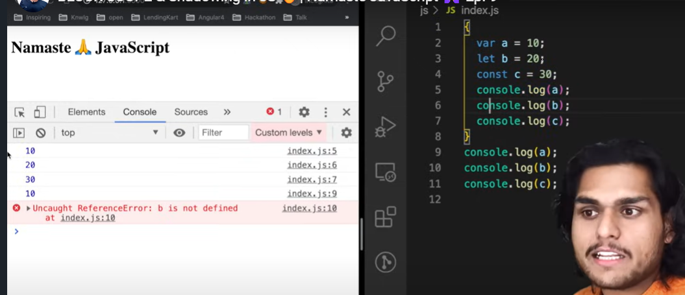
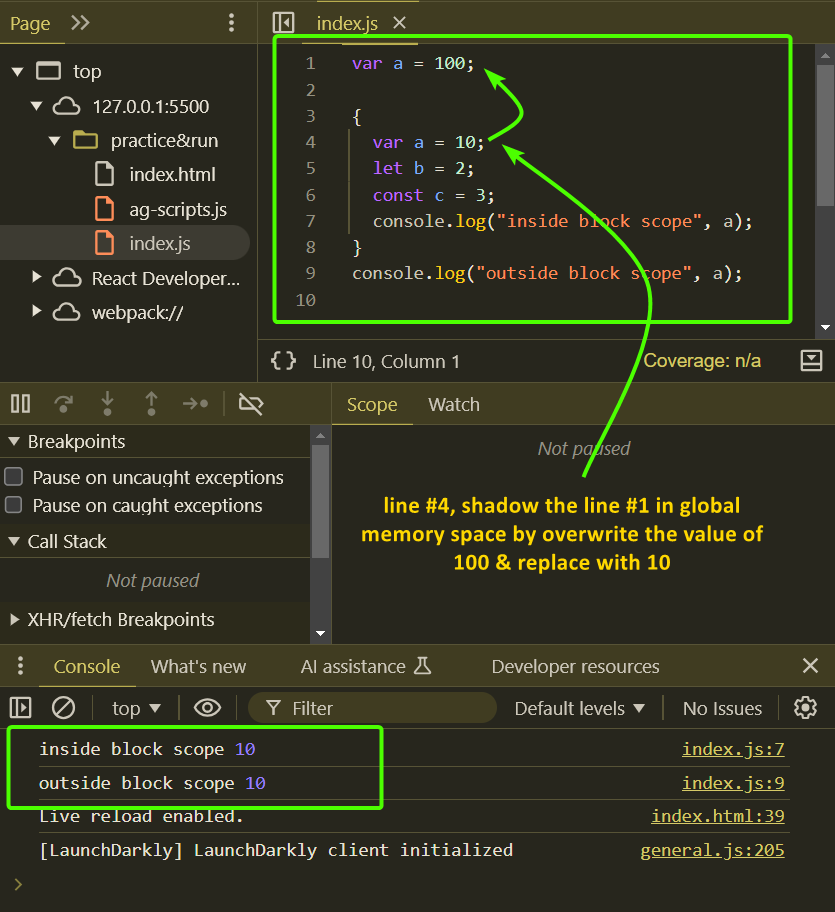
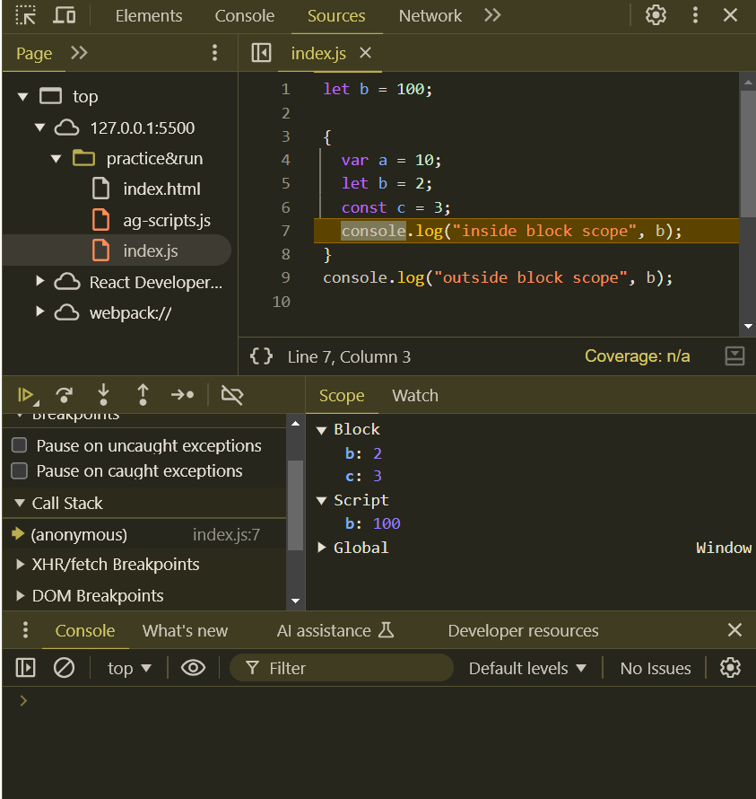
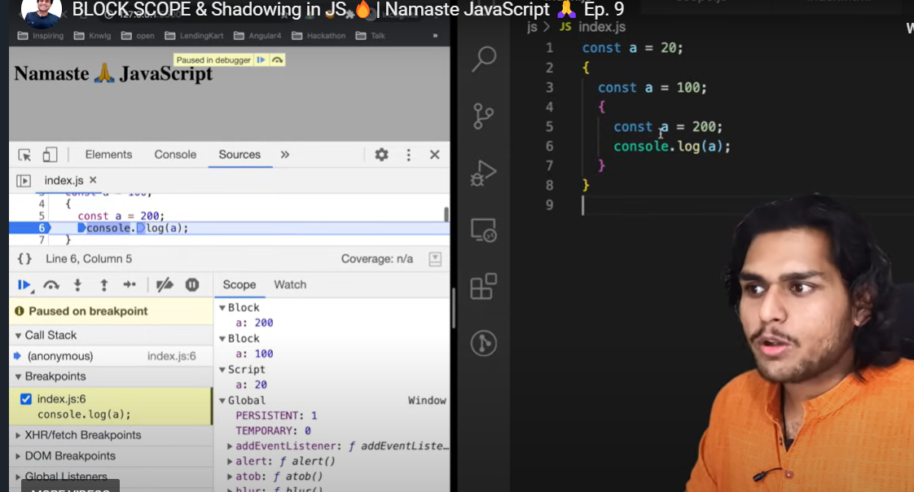

# E9 - BLOCK SCOPE & Shadowing in JS 🔥

> Let & const Block Scope in-depth tutorial covers what is a Block, Scope, and Block Scope in JavaScript. With live code examples and detailed explanations, we also will see what is Shadowing in JavaScript. We also talk about Illegal Shadowing and how different variable declarations using var, let and const behave differently when initialized in the Block Scope.

> Block Scope has a lexical behavior and also follows rules of the Lexical Scope chain. This video covers everything that happens under the hood. The video is a little long but I REQUEST YOU to watch it fully, this concept will help us in later videos. 🙏

- What is **<mark>Block in Javascript</mark>** ?

  - Block and Scope are different things
  - **<mark>Block is defined by curly braces { }</mark>**, why & where do we use it ?
  - Block is also known as Compound Statement
    - **<mark>Block is used to combine multiple JS statements into one group</mark>**
    - why do we make group ?
      - 
    - We can use group of statement where JS expects single statement
  - **<mark>What is Block Scope</mark>** ?

    - What are the variables, functions access inside the block { }
    - Check in below code

      - ```javascript
        {
          var a = 1;
          let b = 2;
          const c = 3;
        }
        ```
      - variable let & const b, c are in blocked scope
      - variable a in global scope

    - 
    - 
    - let & const can not be access outside of block scope, where as var can access the outside of block scope
      - 

  - **<mark>What is Shadowing in Javascript</mark>**?

    - When same variable defined outside the block scope & inside block scope, how variables will shadow and provide access
    - 
    - 
    - Observe in case of let & const
      - 
      - 
      - Separate memory space for block scope variables

  - Block scope follows the lexical scope, which is lexically present, and follow the lexical scope chain pattern
    - 
